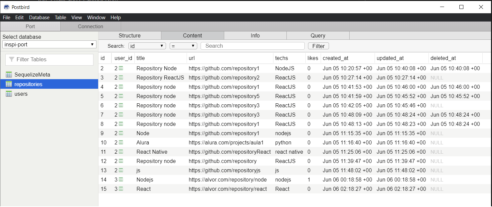
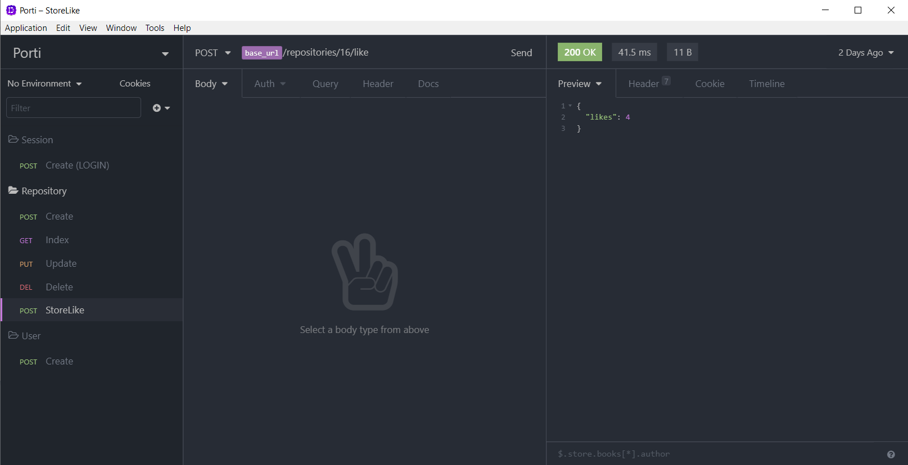
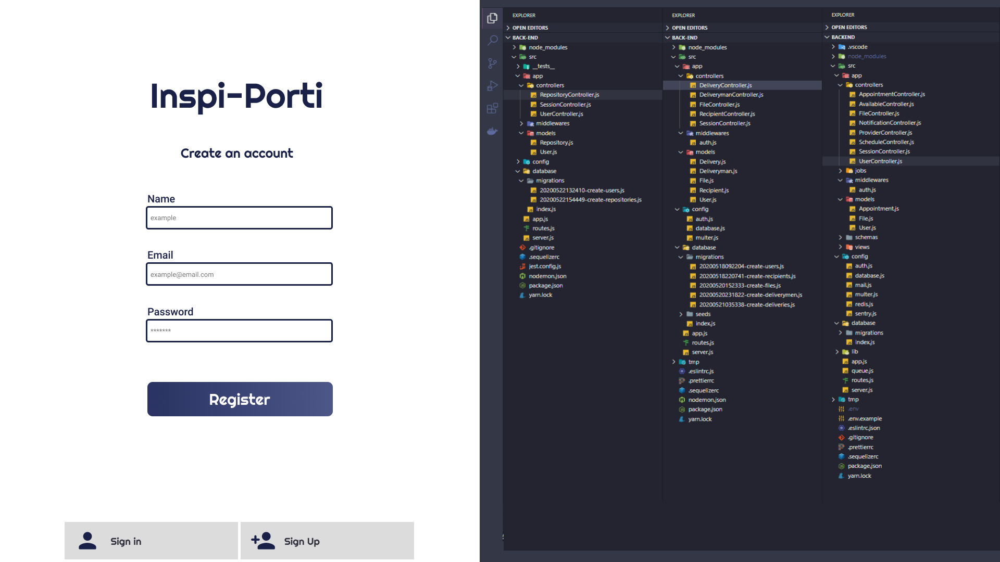
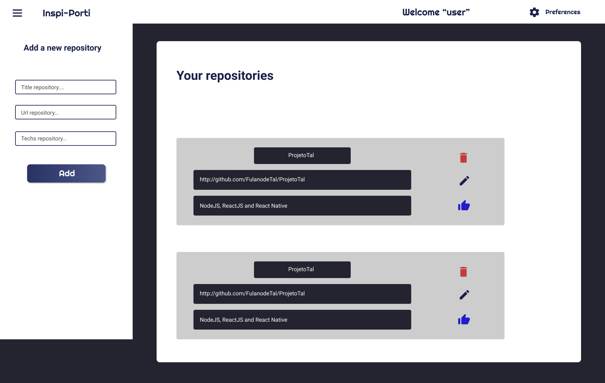
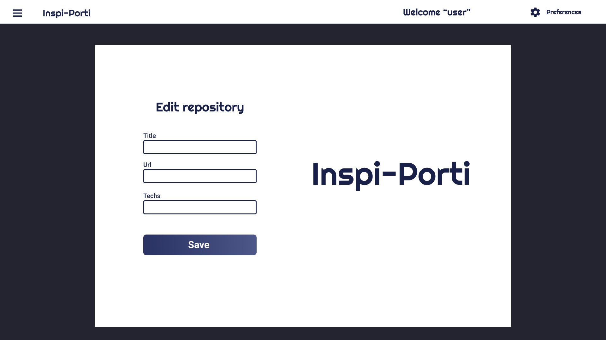

 <h1 align="center">
  </img>
 </h1>

<br>
 
 ###### A escolha do titulo/nome do projeto de portfólio não tem qualquer relação com a COLTECH, fica como critério do desenvolvedor.
 
 # :page_facing_up:	resumo do projeto
 
 Projeto de um Portfólio pessoal para armazenar seus repositórios, com propósito pessoal, ou seja, apenas você verá suas
 publicações de repositórios. Cada repositório salvo/adicionado poderá receber "like" do usuário, como uma parte de sua
 funcionalidade.
 
 ## :gear:	Tecnologias e Ferramentas
 
 * [Node.js](https://nodejs.org/en/)
 * [ReactJS](https://pt-br.reactjs.org)
 * [Insomnia](https://insomnia.rest/download/)
 * [PostgresSQL](https://www.postgresql.org)
 * [Postbird](https://www.electronjs.org/apps/postbird)
 * [Docker](https://www.docker.com/get-started) 
 
 ## :computer_mouse:	Como rodar a aplicação
 - Após clonar o repositório e abra-o em um editor de sua preferência
 - Abra o terminal e rode **yarn**, para fazer as instalações das bibliotecas usadas(que podem ser conferidas no arquivo **package.json**)
 - Após a instalação, abra o caminho onde se encontra o **back-end** e rode ```yarn dev``` para inicializar a execução do projeto
 - Agora, como foi usado um banco de dados relacional, 
   - **caso não tenha tenha as migrations pasta database**, rode o comando 
 ``` yarn sequelize migration:create --name=create-users ``` e ``` yarn sequelize migration:create --name=create-repositories ``` 
   - **caso ja tenha as migrations apenas rode** ```yarn sequelize db:migrate ```
   - assim será criado as migrations do programa e estarão prontas pra serem usadas;
 - **Para vizualição do banco de dados**
   - Para criação da **imagem** do banco de dados (**PostgresSQL**) foi usado o **Docker** e uma forma mais simples de acessar essas imagens de uma forma mais legível é o **Postbird**
   - A imagem é criada pelo comando ```docker run --name database -e POSTGRES_PASSWORD-docker -p 5433:5432 -d postgres:11```
   - e executada, caso não esteja, pelo comando ```docker start database```, o comando ```docker ps``` serve para você vizualizar as imagens que estão rodando
   - Abrindo o Postbird você preencha os campos de acordo com o arquivo **src/config/database.js** e entre
   - nele você poderá criar a database, com a imagem já feita e ter acesso a toda a database, criação, edição e remoção
    <h4 align="center"> </img> </h4>
    
  - Continuado na execução, agora abra o caminho do **front-end** e rode ```yarn start``` para inicializar a execução
  - Espere abrir uma aba no seu navegador, caso não abra, mas o programa estiver em execução sem nenhum problema, entao acesse [localhost:3000](http://localhost:3000)
  - E agora pode-se acessar as funcionalidades da aplicação pelo front ou como um cliente
 
 ## :file_folder: Back-end
 - Todo o projeto foi separado em pastas para organização;
 - Pasta **"app"** se encontra os códigos que tratarão de regras de negócio ou lógica: **controllers da aplicação** e **models** ;
    - **Controllers**: Feature de criação/registro;
    - **Models**: Manipulação de dados;   
 - Pasta **"config"** se encontra configurações do banco de dados;
    - **database.js**: Credencias para acesso à base de dados
 -	O projeto desenvolvido utiliza um banco de dados relacional, **Postgres**, utilizando o ORM **Sequelize** para suporte à
 banco de dados;
 - Pasta **"database"** o arquivo **index.js** faz a conexão com o banco de dados e o carregamento dos models, para que a aplicação tenha acesso à esses models;
 - As funcionalidades das rotas estão dentro de Controllers, sendo assim o arquivo **"routes.js"** contém apenas as rotas de acesso;
 - O arquivo **.sequelizerc** faz a exportação dos caminhos ate pastas como config de database, migrations, models...
 - Todas as funcionalidades da aplicação podem ser acessadas de uma forma mais visual pelo **Insomnia**
 
 <h4 align="center"> </img> </h4>
 
 ## :computer:	Front-end
- Dentro da pasta **"pages"** estão as telas das aplicações com a estrutura, ações e estilização
  - **"Logon"**, **"Register"**, **"Repositories"** e **"Preferecies"**
- **"services"** está a conexao do front-end com o back-end através do **axois** e do **cors**(para permitir que o código do back-end seja acessador por outros)
- As funcionalidades pedidas do front-end estão todas feitas
  - **Add repository**, **Remove repository** e **Exibição dos repositórios**
 
 ## :desktop_computer:	 Layout da aplicação 
 Para vizualizar o design das telas no **Figma** [clique aqui](https://www.figma.com/file/UpWgJVEJb0akKK7fsQbARk/DesafioCOLTECH?node-id=0%3A1)
 ### Login
 <h4> </img> </h4>
 
 ### Register
 <h4> </img> </h4>
 
 ### Home
 <h4> </img> </h4>
 
 ### Edit repository
 <h4> </img> </h4>

