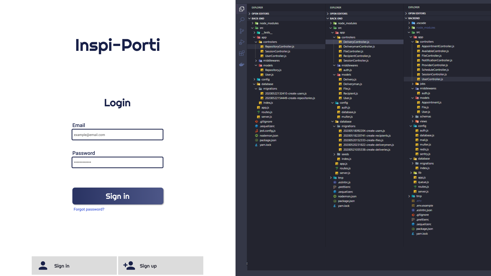

 <h1 align="center">
  </img>
 </h1>
 
 ###### A escolha do titulo/nome do projeto de portfólio não tem qualquer relação com a COLTECH, fica como critério do desenvolvedor.
 
 ## Resumo do projeto
 Projeto de um Portfólio pessoal para armazenar seus repositórios, com propósito pessoal, ou seja, apenas você verá suas
 publicações de repositórios. Cada repositório salvo/adicionado poderá receber "like" do usuário, como uma parte de sua
 funcionalidade.
 
 ### Tecnologias
 * [Node.js](https://nodejs.org/en/)
 * [ReactJS](https://pt-br.reactjs.org)
 
 ### :file_folder: Explicação do desenvolvimento
 - Todo o projeto foi separado em pastas para organização;
 - Pasta **"app"** se encontra os códigos que tratarão de regras de negócio ou lógica: **controllers da aplicação** e **models** ;
    - **Controllers**: Feature de criação/registro;
    - **Models**: Manipulação de dados;   
 - Pasta **"config"** se encontra configurações do banco de dados;
    - **database.js**: Credencias para acesso à base de dados
 -	O projeto desenvolvido utiliza um banco de dados relacional, **Postgres**, utilizando o ORM **Sequelize** para suporte à
 banco de dados;
 - Pasta **"database"** o arquivo **index.js** faz a conexão com o banco de dados e o carregamento dos models, para que a aplicação tenha acesso à esses models;
 - As funcionalidades das rotas estão dentro de Controllers, sendo assim o arquivo **"routes.js"** contém apenas as rotas de acesso;
 - O arquivo **.sequelizerc** faz a exportação dos caminhos ate pastas como config de database, migrations, models...;
 
 ### :desktop_computer:	 Layout da aplicação 
 Para vizualizar o design das telas no **Figma** [clique aqui](https://www.figma.com/file/bEQ5N5CYhMZ9S3o7SCSgGF/DesafioCOLTECH?node-id=0%3A1)
 
 #### Login
 <h4 align="center"> </img> </h4>
 
 #### Register
 <h4 align="center"> </img> </h4>
 
 #### Home
 <h4 align="center"> </img> </h4>
 
 #### Edit repository
 <h4 align="center"> </img> </h4>
